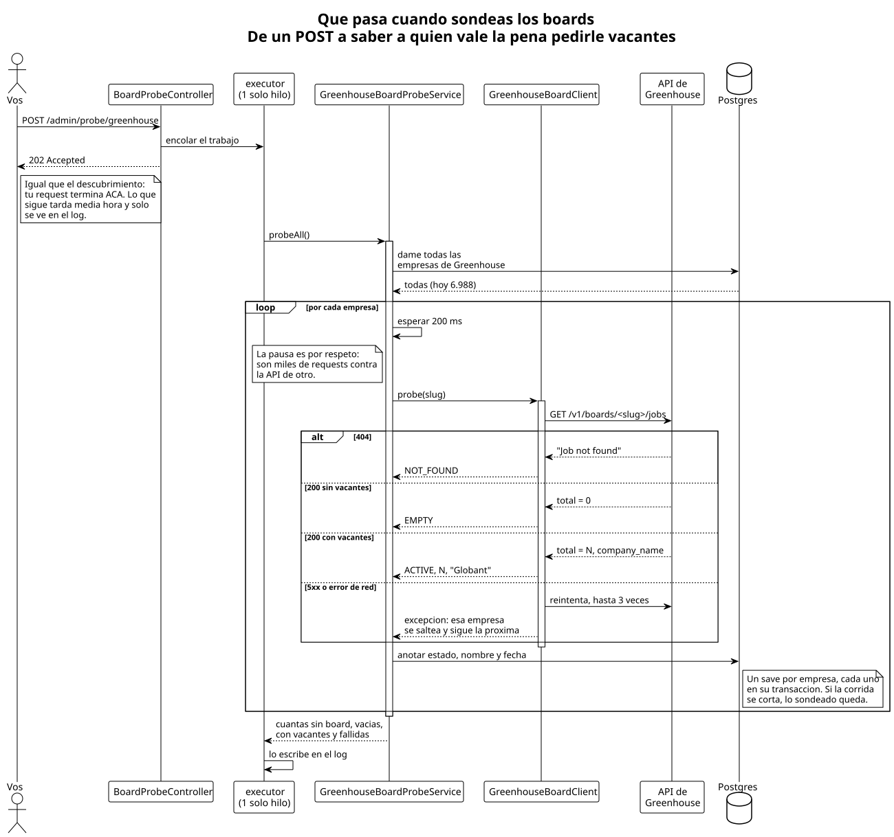

# oneprofile / backend — cómo funciona

> **Esto es para personas, no para agentes.**
>
> Está escrito para entenderse rápido, no para ser exhaustivo. El detalle completo
> —cada decisión, cada trampa, qué está verificado y qué no— vive en
> [`docs/CONTEXTO.md`](../CONTEXTO.md); la forma de trabajar, en
> [`docs/METODOLOGIA.md`](../METODOLOGIA.md).
>
> **Si sos un agente: no leas esta carpeta.** Todo lo que hay acá está duplicado de
> `docs/CONTEXTO.md` en una versión resumida. Leerlo gasta contexto en información
> repetida y te arriesga a trabajar sobre el resumen en vez de sobre la fuente de
> verdad.

---

## Qué es esto

El objetivo final es armar **una buena lista de vacantes laborales que matcheen con
el perfil del usuario**.

Hoy están construidas las dos primeras piezas:

1. **Descubrir qué empresas usan Greenhouse.**
2. **Sondear el board de cada una** para saber cuáles siguen vivas y cuáles tienen
   vacantes publicadas hoy.

Todavía **no hay vacantes guardadas**, ni perfiles, ni matching. De cada empresa se
sabe su identificador corto, si su board existe, cuántas búsquedas tiene abiertas y
cómo se llama.

## La idea de fondo

Las empresas no publican sus vacantes en su propia web: contratan un **ATS**
(Applicant Tracking System) —Greenhouse, Lever, Ashby— y el ATS les da un "board"
público con las búsquedas abiertas.

Eso es bueno, porque cada ATS tiene una API para leer las vacantes de una empresa.
Pero esa API te pide saber **de qué empresa** querés las vacantes, y no hay ninguna
lista pública de empresas por ATS. Ese es el problema que había que resolver
primero.

La salida fue **CommonCrawl**: un archivo público que recorre internet y guarda un
índice de todas las URLs que vio. Si le preguntás por todo lo que empiece con
`boards.greenhouse.io/`, te devuelve decenas de miles de direcciones, y adentro de
cada una está el nombre de la empresa:

```
https://boards.greenhouse.io/mercadolibre/jobs/4567   ← una URL que vio CommonCrawl
                             ^^^^^^^^^^^^
                             esto es el "slug"

https://boards-api.greenhouse.io/v1/boards/mercadolibre/jobs   ← y con eso se piden
                                           ^^^^^^^^^^^^          las vacantes
```

El **slug** es ese identificador corto. Es lo único que el índice te da: el nombre
legible ("Mercado Libre") no aparece ahí, sale recién al preguntarle a la API.

Un detalle que importa: **el slug no es único en el mundo, solo dentro de su ATS.**
Puede haber un `acme` en Greenhouse y otro `acme` en Lever que son empresas
distintas. Por eso acá una empresa se identifica por el **par (ATS, slug)**.

Como preguntarle al índice es caro y lento, esto **no corre solo**: se dispara a
mano cuando hace falta, y el resultado queda guardado en la base.

## Por qué no alcanza con descubrir

CommonCrawl es **una foto vieja de internet**. Que haya visto el board de una empresa
en agosto no quiere decir que hoy siga ahí: las empresas cambian de ATS, cierran, o
se mudan de slug. Con solo descubrir, tenés una lista donde no sabés qué está vivo.

Por eso hay un segundo proceso, el **sondeo**: le pega al board de cada empresa y
anota qué contestó. Hay exactamente tres respuestas posibles:

| Lo que contesta el board | Qué significa |
|---|---|
| `404`, "Job not found" | **No usa Greenhouse.** Estaba en la foto vieja y ya no está. |
| `200` con cero vacantes | **Usa Greenhouse, pero no tiene nada abierto** ahora. |
| `200` con N vacantes | **Tiene búsquedas abiertas.** Es a quien hay que preguntarle. |

Eso es exactamente lo que se necesita para el paso siguiente: **saber a quién vale la
pena pedirle vacantes**, sin desperdiciar miles de requests preguntándole a boards
que no existen.

La primera corrida contra las ~4.000 empresas dio una sorpresa: **la enorme mayoría
sigue viva y con vacantes.** Alrededor de **3.000 activas**, unas **300 que ya no
están en Greenhouse** y unas **80 sin nada publicado**. Se esperaba bastante más
mortandad de la que hubo.

De paso, el sondeo trae el **nombre legible** de la empresa —
"Globant", no `globant` — porque viene adentro de cada vacante. Gratis, sin un
pedido extra. Las empresas que no tienen vacantes abiertas se quedan sin nombre
hasta que publiquen alguna; es el precio de no duplicar la cantidad de pedidos.

## Las piezas


Son dos columnas casi paralelas —un proceso cada una— que se juntan abajo, en la
misma tabla. Cada clase tiene un trabajo bien chico:

Del **descubrimiento**:

- **`DiscoveryController`** — recibe el pedido por HTTP. No sabe nada del negocio:
  solo se ocupa de que no haya dos corridas a la vez y de contestar rápido.
- **`GreenhouseDiscoveryService`** — el que dirige la orquesta. Junta los slugs,
  descarta los que ya tenía y guarda los nuevos.
- **`CommonCrawlIndexClient`** — le pide páginas al índice y las va leyendo.
- **`GreenhouseBoardUrl`** — convierte una URL en un slug. Es texto que entra y
  texto que sale: sin red, sin base, sin nada.

Del **sondeo**:

- **`BoardProbeController`** — el gemelo del otro, con el mismo molde. Que se lean
  igual es a propósito: el patrón ya estaba probado.
- **`GreenhouseBoardProbeService`** — recorre las empresas de a una y anota qué
  contestó cada board.
- **`GreenhouseBoardClient`** — el que le habla a la API de Greenhouse.

Y **`CompanyRepository`**, que es de los dos: habla con Postgres.

Que los dos clientes que salen a internet estén en clases separadas no es capricho.
Son dos servicios ajenos con mañas distintas: el índice de CommonCrawl manda
respuestas de 9 MB y se satura seguido, la API de Greenhouse manda respuestas chicas
y usa el `404` para decirte algo. Mezclarlos sería meter dos problemas en una caja.

## Qué pasa cuando disparás el descubrimiento


Lo importante de este dibujo es que **el POST te contesta al toque**, en un
segundo, con un `202 Accepted` que quiere decir "lo tomé, andá tranquilo". El
trabajo de verdad tarda varios minutos y sigue en otro hilo. **La única forma de
ver cómo terminó es mirar el log:**

```
Greenhouse discovery started on CommonCrawl index CC-MAIN-2026-34
Greenhouse discovery finished: 4046 slugs found, 4046 new companies saved
```

Lo otro que se ve ahí: el cliente **nunca junta todas las URLs en una lista**. Va
leyendo la respuesta línea por línea y entregando una URL a la vez, porque una sola
página del índice pesa unos 9 MB y son unas 12.000 líneas.

Y los slugs se acumulan en un conjunto (un `Set`), que es lo que hace que las
repeticiones se resuelvan solas: la misma empresa aparece en cientos de URLs
distintas y termina siendo una sola entrada.

## Qué pasa cuando sondeás los boards



El molde es el mismo —`202` al toque, el trabajo sigue en otro hilo, el resultado
solo se ve en el log— pero adentro el problema es distinto y hay tres cosas que vale
la pena mirar en el dibujo.

**El `404` no es un error, es una respuesta.** Es la que dice "esta empresa no usa
Greenhouse", que es una de las tres cosas que el sondeo salió a averiguar. Por eso no
se reintenta: insistirle a un board que no existe no lo hace aparecer.

**Hay una pausa de 200 ms entre empresa y empresa.** Son miles de pedidos contra la
API de otro, y no hay ninguna urgencia. La corrida completa tarda alrededor de media
hora, y está bien que así sea.

**Cada empresa se guarda por separado, apenas se la sondea.** Podría parecer más
prolijo guardar todo junto al final, pero entonces media hora de trabajo dependería
de que nada falle en el camino: si el proceso se cae a los veinte minutos, se pierde
todo. Guardando de a una, lo que ya se sondeó queda. Y si un board puntual no
contesta, se anota la falla y **se sigue con el siguiente** — no se tira la corrida
entera por una empresa.

El log al terminar se lee así:

```
Greenhouse board probe started
Greenhouse board probe finished: 4046 companies, N not found, N empty, N active, N failed
```

## Cómo se saca el slug de una URL


Parece trivial —"tomá lo que viene después de la barra"— pero no lo es. Entre las
76.765 URLs de una corrida hay `robots.txt`, hay dominios pelados sin nada
después, y hay una porción grande de **boards embebidos** (`/embed/job_board?for=X`),
que son el mismo board metido dentro de la web de carreras de la empresa. Si esos
se tiraran a la basura se perderían muchísimas empresas.

De las 76.765 capturas de la última corrida salieron **4.046 empresas distintas**, y
solo 229 URLs quedaron afuera. Ese número se verificó aparte, calculándolo fuera de
la app: no se está perdiendo nada.

## Qué se guarda


Sigue siendo **una sola tabla**. La mitad de arriba es lo que deja el
descubrimiento —qué ATS y qué slug—; la de abajo, lo que deja el sondeo: el nombre,
en qué estado está el board y cuándo se lo sondeó por última vez.

Esos tres campos **pueden estar vacíos**, y eso significa algo preciso: una empresa
sin estado de board es una empresa **que nunca se sondeó**. Las 4.000 que cargó el
descubrimiento arrancaron así.

La fecha del último sondeo todavía no la usa nadie. Está para cuando esto corra solo:
con ella se puede pedir "volvé a sondear lo que no se toca hace una semana" en vez de
repasar las 4.000 cada vez.

`Ats` y `BoardStatus` son enums de Java y no tablas. La razón: son listas cerradas
que define el código, no algo que cargue un usuario. Sumar un ATS obliga igual a
escribir la clase que entiende *su* formato de JSON —porque no hay dos ATS que
devuelvan lo mismo—, así que tenerlo en una tabla no evitaría recompilar nada.

## Dónde corre


Hay dos formas de levantarlo, y la diferencia que más se nota es que **en
producción no hay ningún puerto abierto**: para hablarle a la app hay que meterse
adentro del container.

En los dos casos pasa lo mismo al arrancar: Flyway aplica las migraciones que
falten y después Hibernate compara las clases contra las tablas reales. Si alguien
cambió una clase y se olvidó la migración, **la app no arranca** — que es
exactamente lo que se quiere.

## Cómo lo probás vos

En desarrollo, para ver que arranca:

```bash
./mvnw spring-boot:run
```

Levanta solo el Postgres en Docker y queda escuchando en el 8080.

En producción, el ciclo completo:

```bash
cd prod
cp .env.example .env          # solo la primera vez, después completalo
docker compose up --build -d

# 1. descubrir empresas (unos minutos)
docker compose exec app curl -i -X POST \
  'localhost:8080/admin/discovery/greenhouse?index=CC-MAIN-2026-34'

# 2. sondear sus boards (alrededor de media hora)
docker compose exec app curl -i -X POST \
  'localhost:8080/admin/probe/greenhouse'

docker compose logs -f app    # acá se ve cómo terminan
```

Los dos te contestan `202` al instante y siguen trabajando por atrás. Si disparás uno
que ya está corriendo, te contesta `409` y no hace nada: dos corridas a la vez se
pelearían por las mismas empresas.

Para ver el resultado del sondeo, en la base:

```sql
select board_status, count(*) from company group by board_status;
```

El `index=` no tiene valor por defecto, y es a propósito: uno fijo quedaría viejo
en silencio. Los que existen salen de
[`collinfo.json`](https://index.commoncrawl.org/collinfo.json) — **ojo que la
numeración salta**, no todos los números existen.

**Repetir el POST cambiando el índice es la forma de tener más empresas**, y no
hace falta tocar código: lo que ya está guardado no se vuelve a insertar. Cada
crawl nuevo suma del orden de un 25-30% más de empresas que los anteriores no
habían visto.

## Qué sigue

Lo próximo es **traer las vacantes de verdad** de las ~3.000 empresas activas y
guardarlas. Ahí aparece el problema interesante: los títulos son texto libre, escrito
por cada empresa a su manera, y para que el matching sirva hay que hacer que
"Sr. Backend Engineer", "Backend Developer Senior" y "SWE II - Backend" se reconozcan
como el mismo tipo de puesto. Eso todavía no está resuelto ni decidido.
