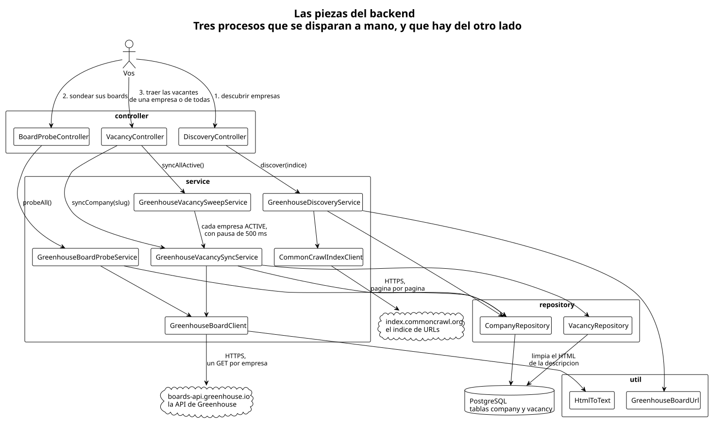
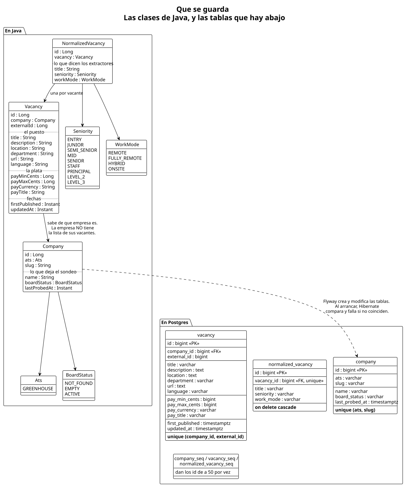
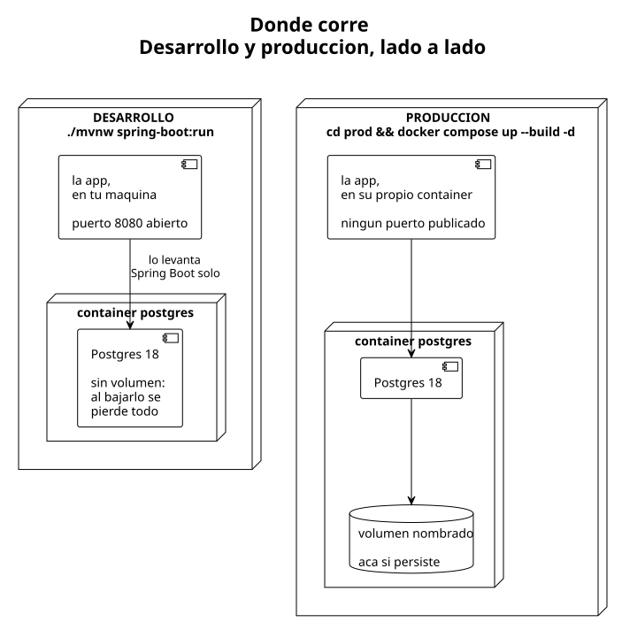

# oneprofile / backend — cómo funciona

> **Esto es para personas, no para agentes.**
>
> Está escrito para entenderse rápido, no para ser exhaustivo. El detalle completo
> —cada decisión, cada trampa, qué está verificado y qué no— vive en
> [`docs/CONTEXTO.md`](../CONTEXTO.md); la forma de trabajar, en
> [`docs/METODOLOGIA.md`](../METODOLOGIA.md).
>
> **Si sos un agente: no leas esta carpeta.** Todo lo que hay acá está duplicado de
> `docs/CONTEXTO.md` en una versión resumida. Leerlo gasta contexto en información
> repetida y te arriesga a trabajar sobre el resumen en vez de sobre la fuente de
> verdad.

Este archivo cuenta qué es el sistema y cómo correrlo. Cada uno de los tres procesos
tiene el suyo:

- [**Cómo se descubren las empresas**](descubrimiento.md) — de dónde sale la lista de
  empresas y cómo se saca el slug de cada URL.
- [**Cómo se categoriza cada empresa**](sondeo.md) — cómo se separa lo que sigue vivo
  de lo que no, y quién tiene vacantes abiertas.
- [**Cómo se traen las vacantes**](vacantes.md) — qué pide la API, las dos trampas del
  JSON, y qué se guarda de cada vacante.

Y aparte, cómo se pone esto a correr fuera de tu máquina:

- [**Cómo se despliega**](despliegue.md) — el pipeline que publica la imagen en cada
  commit, y cómo se levanta y se actualiza en el servidor.

---

## Qué es esto

El objetivo final es armar **una buena lista de vacantes laborales que matcheen con
el perfil del usuario**.

Hoy están construidas las tres piezas:

1. **Descubrir qué empresas usan Greenhouse.**
2. **Sondear el board de cada una** para saber cuáles siguen vivas y cuáles tienen
   vacantes publicadas hoy.
3. **Traer las vacantes**, de una empresa o de las 3.121 activas de una pasada, y borrar
   las que dejaron de estar publicadas.

Las tres corrieron de verdad, y la última ya terminó: hay **128.953 vacantes de 3.118
empresas** en la base.

Ese número tiene una sorpresa adentro: se esperaba **el doble**. La proyección se había
hecho con el **promedio** de una muestra —80 vacantes por empresa—, y el promedio estaba
inflado por un puñado de empresas enormes: Stripe sola tiene 628. La guía correcta era la
**mediana**, que era 17. Es el tipo de error que conviene recordar: en datos así, el
promedio miente y la mediana no.

Todavía no hay perfiles ni matching. De cada empresa se sabe su identificador corto,
si su board existe, cuántas búsquedas tiene abiertas y cómo se llama; y de las
empresas que se hayan pedido, sus vacantes con descripción y sueldo.

## La idea de fondo

Las empresas no publican sus vacantes en su propia web: contratan un **ATS**
(Applicant Tracking System) —Greenhouse, Lever, Ashby— y el ATS les da un "board"
público con las búsquedas abiertas.

Eso es bueno, porque cada ATS tiene una API para leer las vacantes de una empresa.
Pero esa API te pide saber **de qué empresa** querés las vacantes, y para eso hace
falta su **slug**: el identificador corto que aparece en la URL de su board.

```
https://boards.greenhouse.io/mercadolibre/jobs/4567   ← el board público
                             ^^^^^^^^^^^^
                             esto es el "slug"

https://boards-api.greenhouse.io/v1/boards/mercadolibre/jobs   ← y con eso se piden
                                           ^^^^^^^^^^^^          las vacantes
```

El slug es lo único que se consigue de arranque: el nombre legible ("Mercado Libre")
sale recién al preguntarle a la API. De dónde salen esos slugs es toda una historia,
y está en [cómo se descubren las empresas](descubrimiento.md).

Un detalle que importa: **el slug no es único en el mundo, solo dentro de su ATS.**
Puede haber un `acme` en Greenhouse y otro `acme` en Lever que son empresas
distintas. Por eso acá una empresa se identifica por el **par (ATS, slug)**.

## Las piezas



Son tres caminos casi paralelos —un proceso cada uno— que se juntan abajo, en la misma
base. Cada clase tiene un trabajo bien chico:

Del **descubrimiento**:

- **`DiscoveryController`** — recibe el pedido por HTTP. No sabe nada del negocio:
  solo se ocupa de que no haya dos corridas a la vez y de contestar rápido.
- **`GreenhouseDiscoveryService`** — el que dirige la orquesta. Junta los slugs,
  descarta los que ya tenía y guarda los nuevos.
- **`CommonCrawlIndexClient`** — le pide páginas al índice y las va leyendo.
- **`GreenhouseBoardUrl`** — convierte una URL en un slug. Es texto que entra y
  texto que sale: sin red, sin base, sin nada.

Del **sondeo**:

- **`BoardProbeController`** — el gemelo del otro, con el mismo molde. Que se lean
  igual es a propósito: el patrón ya estaba probado.
- **`GreenhouseBoardProbeService`** — recorre las empresas de a una y anota qué
  contestó cada board.
- **`GreenhouseBoardClient`** — el que le habla a la API de Greenhouse.

De las **vacantes**:

- **`VacancyController`** — el único que atiende dos pedidos distintos: una empresa suelta
  y todas juntas. Contestan diferente a propósito. La empresa suelta tarda un segundo, así
  que la respuesta trae ya la cuenta de lo que cargó; la corrida completa tarda horas, así
  que contesta "ya arranqué" como los otros dos procesos.
- **`GreenhouseVacancySyncService`** — pide el board de una empresa y decide, vacante
  por vacante, si es nueva, si ya la tenía guardada, o si dejó de estar y hay que borrarla.
- **`GreenhouseVacancySweepService`** — el que repite eso para las 3.121 activas, con una
  pausa entre empresa y empresa.
- **`HtmlToText`** — desarma el HTML de la descripción hasta dejar texto que una
  persona pueda leer. Texto que entra, texto que sale: nada más.

Que el recorrido sea una clase aparte y no un método más del anterior tiene una razón
concreta, y es de las cosas que uno descubre a los golpes: **Spring abre una transacción
con la base cuando entrás a un objeto desde afuera, no cuando un objeto se llama a sí
mismo.** Si el recorrido viviera adentro del mismo servicio, las dos horas de corrida
quedarían sin esa red de contención por empresa.

El `GreenhouseBoardClient` **es el mismo para el sondeo y para las vacantes**, con dos
usos distintos: el sondeo pide el board pelado y solo mira cuántas vacantes hay, y este
proceso lo pide con la descripción y el sueldo. Es el mismo servicio ajeno con las
mismas mañas, así que sería raro tener dos clases para hablarle.

Y los dos repositorios, **`CompanyRepository`** y **`VacancyRepository`**, que son los
que hablan con Postgres.

Que los dos clientes que salen a internet estén en clases separadas no es capricho.
Son dos servicios ajenos con mañas distintas: el índice de CommonCrawl manda
respuestas de 9 MB y se satura seguido, la API de Greenhouse manda respuestas chicas
y usa el `404` para decirte algo. Mezclarlos sería meter dos problemas en una caja.

## Qué se guarda



Ahora son **dos tablas**. En `company`, la mitad de arriba es lo que deja el
descubrimiento —qué ATS y qué slug—; la de abajo, lo que deja el sondeo: el nombre,
en qué estado está el board y cuándo se lo sondeó por última vez.

Esos tres campos **pueden estar vacíos**, y eso significa algo preciso: una empresa
sin estado de board es una empresa **que nunca se sondeó**. Las 4.046 que cargó el
descubrimiento arrancaron así.

La fecha del último sondeo todavía no la usa nadie. Está para cuando esto corra solo:
con ella se puede pedir "volvé a sondear lo que no se toca hace una semana" en vez de
repasar las 4.046 cada vez.

En `vacancy` hay dos cosas que vale la pena mirar. La primera: **la vacante sabe de qué
empresa es, pero la empresa no tiene la lista de sus vacantes.** Parece una asimetría
molesta y es a propósito: una empresa grande tiene cientos de búsquedas, y una lista así
colgada de la empresa se convierte en una trampa —cada vez que tocás una empresa te
arrastra todo lo demás—.

La segunda: además del id propio, cada vacante guarda el **id que le puso Greenhouse**.
Sirve para reconocerla la próxima vez que se pida el mismo board y decidir si hay que
actualizarla o insertarla. Ese id **no es único en el mundo, solo dentro de su board** —
la misma historia que el slug—, así que lo que no se puede repetir es el par
(empresa, id de Greenhouse).

`Ats` y `BoardStatus` son enums de Java y no tablas. La razón: son listas cerradas
que define el código, no algo que cargue un usuario. Sumar un ATS obliga igual a
escribir la clase que entiende *su* formato de JSON —porque no hay dos ATS que
devuelvan lo mismo—, así que tenerlo en una tabla no evitaría recompilar nada.

## Dónde corre



Hay dos formas de levantarlo. **Desarrollo corre en tu máquina y producción en un
servidor**, con la imagen bajada del registry: cómo llega hasta ahí está en
[cómo se despliega](despliegue.md). La diferencia que más se nota es que **en
producción no hay ningún puerto abierto**: para hablarle a la app hay que meterse
adentro del container.

En los dos casos pasa lo mismo al arrancar: Flyway aplica las migraciones que
falten y después Hibernate compara las clases contra las tablas reales. Si alguien
cambió una clase y se olvidó la migración, **la app no arranca** — que es
exactamente lo que se quiere.

## Cómo lo probás vos

En desarrollo, para ver que arranca:

```bash
./mvnw spring-boot:run
```

Levanta solo el Postgres en Docker y queda escuchando en el 8080.

En producción —o sea, en el servidor— el ciclo completo:

```bash
cd ~/oneprofile
docker compose pull
docker compose up -d

# 1. descubrir empresas (unos minutos)
docker compose exec app curl -i -X POST \
  'localhost:8080/admin/discovery/greenhouse?index=CC-MAIN-2026-34'

# 2. sondear sus boards (alrededor de media hora)
docker compose exec app curl -i -X POST \
  'localhost:8080/admin/probe/greenhouse'

docker compose logs -f app    # acá se ve cómo terminan

# 3a. traer las vacantes de una empresa (un segundo)
docker compose exec app curl -i -X POST \
  'localhost:8080/admin/vacancies/greenhouse/figma'

# 3b. o las de todas las empresas activas (varias horas)
docker compose exec app curl -i -X POST \
  'localhost:8080/admin/vacancies/greenhouse'
```

**Todos te contestan `202` al instante y siguen trabajando por atrás**, menos el de una
empresa sola. El resultado se ve en el log. Si disparás uno que ya está corriendo, te
contesta `409` y no hace nada: dos corridas a la vez se pelearían por las mismas empresas.

**El de una empresa es la excepción:** contesta en la misma respuesta, con la cuenta de lo
que cargó (`{"fetched":153,"inserted":153,"updated":0,"deleted":0}`), porque tarda un
segundo y ahí esperar es lo más cómodo. Está explicado en
[cómo se traen las vacantes](vacantes.md), junto con el detalle incómodo de que en
desarrollo la base arranca vacía.

**Y el orden de arriba es el orden real**, no una sugerencia: el recorrido de vacantes
solo le pregunta a las empresas que el sondeo dejó marcadas como activas.

Para ver el resultado del sondeo, en la base:

```sql
select board_status, count(*) from company group by board_status;
```

El `index=` no tiene valor por defecto, y es a propósito: uno fijo quedaría viejo
en silencio. Los que existen salen de
[`collinfo.json`](https://index.commoncrawl.org/collinfo.json) — **ojo que la
numeración salta**, no todos los números existen.

**Repetir el POST cambiando el índice es la forma de tener más empresas**, y no
hace falta tocar código: lo que ya está guardado no se vuelve a insertar. Cada
crawl nuevo suma empresas que los anteriores no habían visto.

## Qué sigue

Con las vacantes ya cargadas, lo próximo es el problema interesante: los títulos son
texto libre, escritos por cada empresa a su manera, y para que el matching sirva hay que
lograr que "Sr. Backend Engineer", "Backend Developer Senior" y "SWE II - Backend" se
reconozcan como el mismo tipo de puesto. Está en curso y todavía no se puede contar como
funcionando.

Que todo esto haya salido de la máquina de Elias y viva en un servidor es porque ya no
son experimentos sueltos, sino procesos que tienen que correr seguido —y más adelante en
paralelo, con más ATS—: cerrás el SSH y la corrida sigue.
