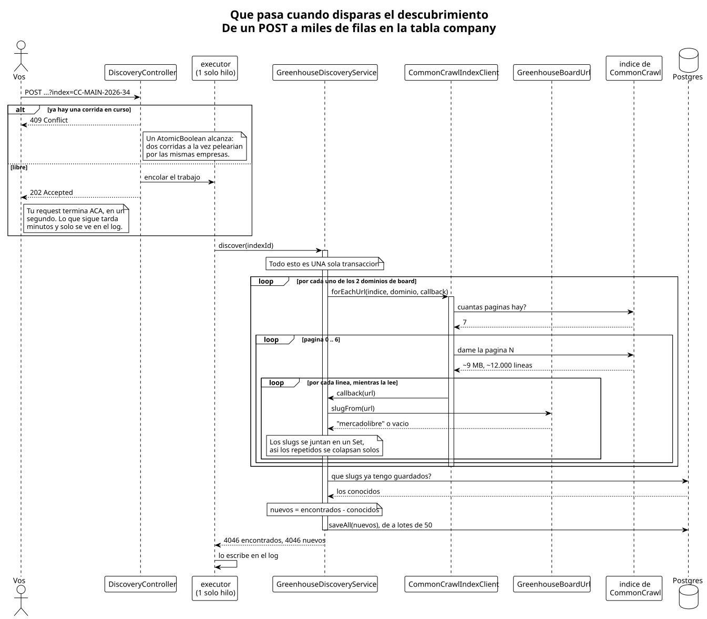
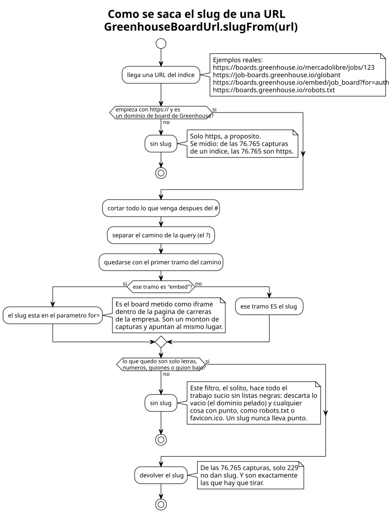

# Cómo se descubren las empresas

> Para personas, no para agentes. Volvé al [README](README.md); el detalle completo
> está en [`docs/agents/CONTEXTO.md`](../agents/CONTEXTO.md).

## De dónde sale la lista

Para pedirle las vacantes a la API de Greenhouse hay que saber **de qué empresa** las
querés, y no existe ninguna lista pública de empresas por ATS. Ese fue el primer
problema a resolver.

La salida fue **CommonCrawl**: un archivo público que recorre internet y guarda un
índice de todas las URLs que vio. Si le preguntás por todo lo que empiece con
`boards.greenhouse.io/`, te devuelve decenas de miles de direcciones, y adentro de
cada una está el slug de la empresa.

Preguntarle al índice es caro y lento, así que esto **no corre solo**: se dispara a
mano cuando hace falta y el resultado queda guardado en la base.

## Un índice solo ve una parte

CommonCrawl publica un índice nuevo cada uno o dos meses, y **cada uno es una recorrida
distinta**. Uno trae unas 4.000 empresas, pero el siguiente solo repite unas 3.000: el
resto son otras. Juntando 16 índices se llega a **10.086** empresas, y los de hace dos
años todavía suman algunas.

Por eso el descubrimiento ya no lee un índice: lee **los 10 más recientes**. No hace
falta leer los 127 que hay. Existe otra fuente, la **Wayback Machine**, que ya se midió y
trae muchas más (ver "Puntos abiertos" en el [README](README.md)).

## Qué pasa cuando lo disparás



Lo importante de este dibujo es que **el POST te contesta al toque**, en un segundo,
con un `202 Accepted` que quiere decir "lo tomé, andá tranquilo". El trabajo de verdad
tarda varios minutos y sigue en otro hilo. **La única forma de ver cómo terminó es
mirar el log**, que deja una línea por índice y una al final:

```
Greenhouse discovery started on the most recent CommonCrawl indexes
CommonCrawl index CC-MAIN-2026-34: N slugs found, M new companies saved
...
Greenhouse discovery on CommonCrawl finished: 10 indexes read, M new companies saved, 0 indexes failed []
```

Tres cosas que se ven en el dibujo:

- **El cliente nunca junta todas las URLs en una lista.** Va leyendo línea por línea y
  entrega una URL a la vez, porque una sola página del índice pesa unos 9 MB.
- **Los slugs se juntan en un conjunto** (un `Set`), así que las repeticiones se
  resuelven solas: la misma empresa aparece en cientos de URLs y queda una sola vez.
- **Se guarda al terminar cada índice, y uno que falla no corta nada.** El índice se
  satura seguido. Si falla uno, queda anotado y se sigue con el próximo, y lo que
  trajeron los demás ya está en la base.

Repetirlo no rompe nada: lo que ya está guardado no se vuelve a insertar.

## Cómo se saca el slug de una URL



Parece trivial —"tomá lo que viene después de la barra"— pero no lo es. Entre las URLs
que devuelve el índice hay `robots.txt`, hay dominios pelados sin nada después, y hay
una porción grande de **boards embebidos** (`/embed/job_board?for=X`), que son el mismo
board metido dentro de la web de carreras de la empresa. Si esos se tiraran a la basura
se perderían muchísimas empresas.

Que no se pierde nada se verificó aparte, con un índice: se bajaron sus páginas a mano,
se aplicaron las mismas reglas fuera de la app y dio **exactamente 4.046**, lo mismo que
había guardado la app.
