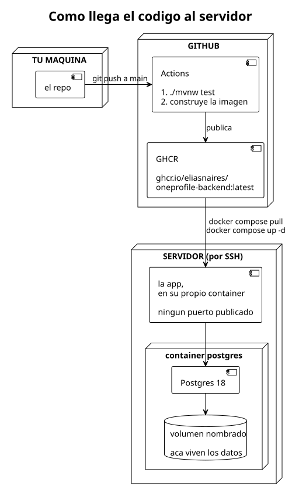

# Cómo se despliega

> **Esto es para personas, no para agentes.** El detalle completo vive en
> [`docs/agents/CONTEXTO.md`](../agents/CONTEXTO.md).

Hasta acá prod era `docker compose up --build -d` en la máquina de Elias: la imagen se
construía ahí y los datos vivían en un volumen local. Eso dejó de alcanzar. El
descubrimiento y el sondeo tardan horas, y esas horas no deberían depender de que una
laptop esté prendida.

Ahora **prod corre en un servidor**, y la imagen de la app viaja hasta él por un
registry público. Ya está andando: el pipeline publica, el servidor baja la imagen y los
datos están ahí.



## Cómo llega el código al servidor

Cada `git push` a `main` dispara un workflow de GitHub Actions
([`.github/workflows/publish.yml`](../../.github/workflows/publish.yml)) que hace dos
cosas, en orden:

1. **Corre `mvn test`.** Si algo falla, ahí se corta y no se publica nada. Usa el Maven
   que ya trae el runner y no `./mvnw`, porque desde GitHub la descarga del wrapper se
   corta.
2. **Construye la imagen y la publica** en GHCR, el registry de GitHub, como
   `ghcr.io/eliasnaires/oneprofile-backend:latest`.

En el servidor, desplegar la versión nueva son dos comandos: bajar la imagen y
recrear el container.

Una aclaración que confunde seguido: **en el registry viaja solo la app** —el jar
adentro de un JRE—. El Postgres, el volumen donde viven los datos y el cableado entre
los dos containers no están en ninguna imagen: están en el `compose.yaml`, que el
servidor tiene copiado. Lo que el servidor ya **no** necesita es el código: no compila
nada, así que no hay Java ni Maven ni una copia del repo.

Sobre los tests, un detalle que parece una contradicción: el `Dockerfile` construye el
jar con `-DskipTests`, pero el pipeline sí los corre. No es un olvido. Los tests usan
Testcontainers, que necesita un Docker a mano para levantar un Postgres de verdad, y
adentro del build de una imagen ese Docker no existe. En el runner de GitHub sí, así
que los tests corren ahí, **antes** y por fuera de la construcción de la imagen.

## Qué necesita el servidor

Docker con el plugin de compose, y nada más:

```bash
docker compose version
```

Si eso responde una versión, está todo.

## La primera vez

**1. Que el paquete sea público.** La primera vez que el workflow publica, GitHub crea
el paquete **privado**. Hay que entrar a la página de packages del repo, abrir
`oneprofile-backend` → *Package settings* → *Change visibility* → **Public**. Es una
sola vez; si no, el servidor no puede bajar la imagen sin credenciales.

**2. Los dos archivos que el servidor necesita.** Desde tu máquina:

```bash
scp prod/compose.yaml prod/.env servidor:~/oneprofile/
```

(creá la carpeta antes con `ssh servidor mkdir -p oneprofile`). El `.env` no está en el
repo — tiene las credenciales de la base — así que es el único que hay que copiar con
cuidado.

**3. Levantarlo.** En el servidor:

```bash
cd ~/oneprofile
docker compose pull
docker compose up -d
docker compose logs -f app
```

Tiene que aparecer Flyway aplicando las migraciones y después `Started BackendApplication`.

Si vas a mudar los datos que ya tenés, hacelo **antes** de este paso: mirá la sección
que sigue.

## Llevar los datos que ya existen

Las 4.046 empresas y su sondeo costaron horas de corrida. Se mudan con un dump, no se
rehacen. **El orden importa**: la base se restaura con la app todavía apagada, porque
el dump trae las tablas *y* el historial de migraciones de Flyway; si la app arranca
primero, crea el esquema vacío y el restore choca.

En tu máquina:

```bash
cd prod
docker compose up -d postgres
docker compose exec -T postgres sh -c 'pg_dump -U "$POSTGRES_USER" -d "$POSTGRES_DB"' > ~/oneprofile.sql
scp ~/oneprofile.sql servidor:~/
```

En el servidor, con la app sin levantar:

```bash
cd ~/oneprofile
docker compose up -d postgres          # solo la base
docker compose exec -T postgres sh -c 'psql -U "$POSTGRES_USER" -d "$POSTGRES_DB"' < ~/oneprofile.sql
```

Para ver que llegó todo:

```bash
docker compose exec -T postgres sh -c \
  'psql -U "$POSTGRES_USER" -d "$POSTGRES_DB" -c "select board_status, count(*) from company group by board_status"'
```

Tienen que ser los mismos números que en tu máquina. Y recién ahí:

```bash
docker compose up -d
```

En el log de la app, Flyway va a aplicar **solo las migraciones que al dump le
faltaban**, y ninguna de las que ya traía. Eso es lo que confirma que el historial viajó
adentro del dump: si las reaplicara todas, el dump no habría traído
`flyway_schema_history` y estarías pisando datos.

En la mudanza real pasó justo eso: la base de origen estaba una migración atrás —no tenía
todavía la tabla de vacantes—, así que Flyway aplicó esa y la creó vacía, con las 4.046
empresas ya adentro. Salió bien, pero conviene mirar el log y entender **cuáles** aplicó
en vez de dar por hecho que no aplicó ninguna.

Usá el **mismo `.env`** de los dos lados. Si el usuario de la base no coincide, el
restore se queja de dueños que no existen.

## Cada cambio, de ahí en más

```bash
git push                     # en tu máquina, a main
```

Esperás a que el workflow termine en verde (pestaña *Actions* del repo), y en el
servidor:

```bash
cd ~/oneprofile
docker compose pull
docker compose up -d
```

`up -d` recrea **solo** el container de la app, porque es el único cuya imagen cambió.
El Postgres y sus datos quedan intactos.

Lo único que se copia a mano es el `compose.yaml`, y solo cuando cambia — que es casi
nunca.

## Cómo se dispara cada proceso

Igual que antes, desde adentro del container: **no hay ningún puerto publicado**, ni el
de la app ni el de la base. La VPN sirve para llegar por SSH al servidor; la app no
está expuesta a nadie.

```bash
cd ~/oneprofile

# descubrir empresas en los 10 índices más nuevos de CommonCrawl (minutos)
docker compose exec app curl -i -X POST 'localhost:8080/admin/discovery/greenhouse/commoncrawl'

# sondear sus boards (media hora o más)
docker compose exec app curl -i -X POST 'localhost:8080/admin/probe/greenhouse'

# traer las vacantes de todas las activas (horas)
docker compose exec app curl -i -X POST 'localhost:8080/admin/vacancies/greenhouse'

# normalizar los títulos (segundos)
docker compose exec app curl -i -X POST 'localhost:8080/admin/normalization/vacancies'

docker compose logs -f app
```

La ventaja de tenerlo acá es justamente esa: cerrás el SSH y la corrida sigue.

## Cuando algo sale mal

- **El workflow falló.** Mirá cuál de los dos jobs: si es el de tests, la imagen no se
  publicó y el servidor sigue con la versión anterior — que es exactamente lo que se
  quiere. Arreglás, pusheás de nuevo.
- **`docker compose pull` dice `denied` o pide usuario.** El paquete quedó privado:
  volvé al punto 1 de "La primera vez".
- **`pull` no baja nada y la app sigue vieja.** Fijate que el workflow haya terminado:
  el tag es siempre `latest`, así que si pullés antes de que publique te llevás la de
  antes.
- **La app no arranca.** `docker compose logs app`. Casi siempre es Flyway: o no puede
  conectarse (revisá el `.env`) o encuentra el esquema en un estado que no espera.
