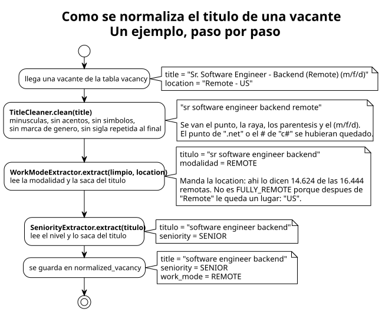

# Cómo se normalizan los títulos

> Para personas, no para agentes. Volvé al [README](README.md); el detalle completo
> está en [`docs/agents/CONTEXTO.md`](../agents/CONTEXTO.md).

## Para qué

Con las [vacantes](vacantes.md) en la base aparece el problema de fondo: **cada empresa
escribe el título a su manera**. "Sr. Software Engineer - Backend", "Senior Software
Engineer (Backend)" y "software engineer, backend — senior" son el mismo puesto, y
comparados como texto son tres puestos distintos.

Lo que viene después es separar las vacantes **tech-adyacentes** de las que no, usando el
título como señal. Para eso el título tiene que llegar limpio. Viene sucio de dos
maneras:

- **De formato**: puntos, paréntesis, rayas, mayúsculas, un `(m/f/d)` al final.
- **Con datos metidos adentro**: el nivel ("Senior") y la modalidad ("Remote") no son el
  puesto, pero viajan escritos en el título.

La normalización arregla las dos cosas: deja el título pelado y saca el nivel y la
modalidad **a campos propios**, en vez de tirarlos.

## El recorrido de un título



Son tres funciones en fila, y cada una recibe lo que dejó la anterior. Ninguna habla con
la red ni con la base: entra texto y sale texto, así que cada una se prueba sola con
títulos reales.

El mismo ejemplo con otra `location` da otro resultado. Con `location = "Remote"`, a
secas, la modalidad sale **`FULLY_REMOTE`**: remoto y sin nombrar ningún lugar, o sea
que puede aplicar cualquiera.

## Limpiar: se enumera lo que se queda, no lo que se va

Se saca **todo** lo que no sea letra, número o espacio. La lista de lo que molesta nunca
se termina; la de lo que importa es corta. Quedan cuatro símbolos, y solo donde
significan algo: el punto de `.net`, el `#` de `c#`, el `+` de `c++` y el `&` de `r&d`.

Después se van dos cosas más:

- **La marca de género** (`h/f`, `m/w/d`...), entera. Una `f` suelta puede ser cualquier
  cosa, así que no se borran letras sueltas.
- **La sigla que repite el título**, pero solo si sus letras son las iniciales de las
  palabras de antes. "Registered Behavior Technician (RBT)" pierde el `rbt`. En cambio
  "Account Executive (US)" o "Senior Architect .NET" no pierden nada. Borrar lo que cierra
  el título sin mirar sería la regla fácil, y se llevaría puesto justo lo que importa.

## La modalidad: manda la ubicación

La señal casi nunca está en el título. De las 16.444 vacantes remotas, **14.624 lo dicen
solo en la `location`**. Por eso se lee de los dos lados, y si la `location` nombra una
modalidad, esa gana.

- **Sin dato no es presencial.** Si nada dice cómo se trabaja, el campo queda vacío.
  Suponer "presencial" sería inventar el dato para 112.508 vacantes.
- **Los sinónimos salieron de los datos.** `wfh`, `remoto` y `home based` están porque
  aparecen. `telework` o `teletrabajo` no están porque se buscaron y hay cero. `virtual`
  quedó afuera a propósito: "Virtual Assistant" es un puesto.

## El nivel: un campo propio, con cuidado

Estaba adentro de **una de cada cuatro** vacantes, y sacarlo junta más títulos que toda
la limpieza de símbolos.

- **No todo lo que suena a nivel lo es.** `director`, `lead` o `head` se quedan en el
  título, porque son el puesto: un director de ingeniería no es un ingeniero.
- **Tres palabras engañan y tienen guarda.** `entry` en "data entry", `mid` en "mid
  market", `staff` en "chief of staff" o "staff nurse". Ahí la palabra es parte del puesto
  y no se toca.
- **Si el título nombra dos niveles, gana el más bajo.** "Junior to Senior Project
  Manager" acepta gente desde junior, y eso es lo que importa para matchear.
- **Es un nombre, no un número.** "Engineer II" no dice a qué nivel equivale, y `staff`
  contra `principal` lo ordena cada empresa a su manera. Del nombre se puede sacar un
  número después; al revés no se puede.

## Por qué va en una tabla aparte

`vacancy` es **un espejo del board**: cada carga pisa lo que cambió y borra lo que ya no
está. Lo normalizado es **un cálculo sobre eso**, y se rehace entero cada vez que cambia
una regla, sin volver a pedirle nada a Greenhouse. Mezclarlos obligaría a la carga a
cuidar columnas que no vienen del board.

Cuando la carga borra una vacante, Postgres borra solo su fila normalizada. La carga ni
se entera de que esa tabla existe.

## Lo que dio en prod

Corrió sobre las **128.953 vacantes en 24 segundos**. Sin red de por medio no hace falta
pausa: el trabajo va en tandas de 1.000, cada una guardada por su lado.

- Los títulos distintos bajaron de **87.647 a 77.630** (−11,4%).
- **32.219** vacantes tienen nivel y **19.255** declaran modalidad.
- Arriba de todo quedaron `software engineer` (884), `account executive` (505) y
  `registered behavior technician` (466), que ya junta a los que venían con `(RBT)`.

Cada número coincidió con lo medido antes de escribir las reglas. Ese es el orden de
trabajo: primero se mide contra los datos reales, y recién después se escribe la regla.

## Cómo lo corrés

```bash
cd ~/oneprofile

# rehace todas las filas (lo que se corre después de cambiar una regla)
docker compose exec app curl -i -X POST 'localhost:8080/admin/normalization/vacancies'

# o solo las vacantes que todavía no tienen fila
docker compose exec app curl -i -X POST 'localhost:8080/admin/normalization/vacancies/missing'

docker compose logs -f app
```

Mismo molde que los demás: `202` al toque y el resultado en el log. Los dos endpoints
escriben la misma tabla, así que **mientras corre uno, los dos contestan `409`**.

## Lo que se probó y no entró

No todo lo que parece ruido merece una regla. Se probaron once criterios más: la ciudad
metida en el título, plata, fechas, números de búsqueda, idioma. Juntos bajaban los
títulos distintos un **2,4%**, contra el 5,8% que baja el nivel solo. La ciudad, además,
se equivocaba: un diccionario de lugares toma `west` o `park` por ciudades.
